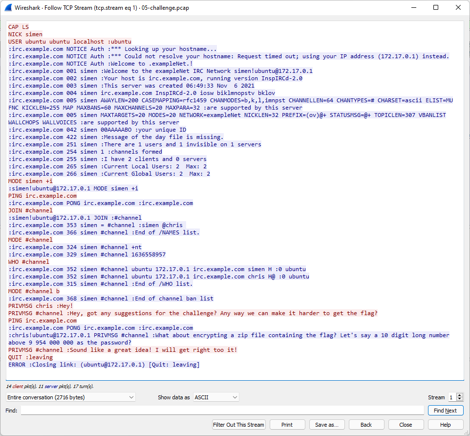
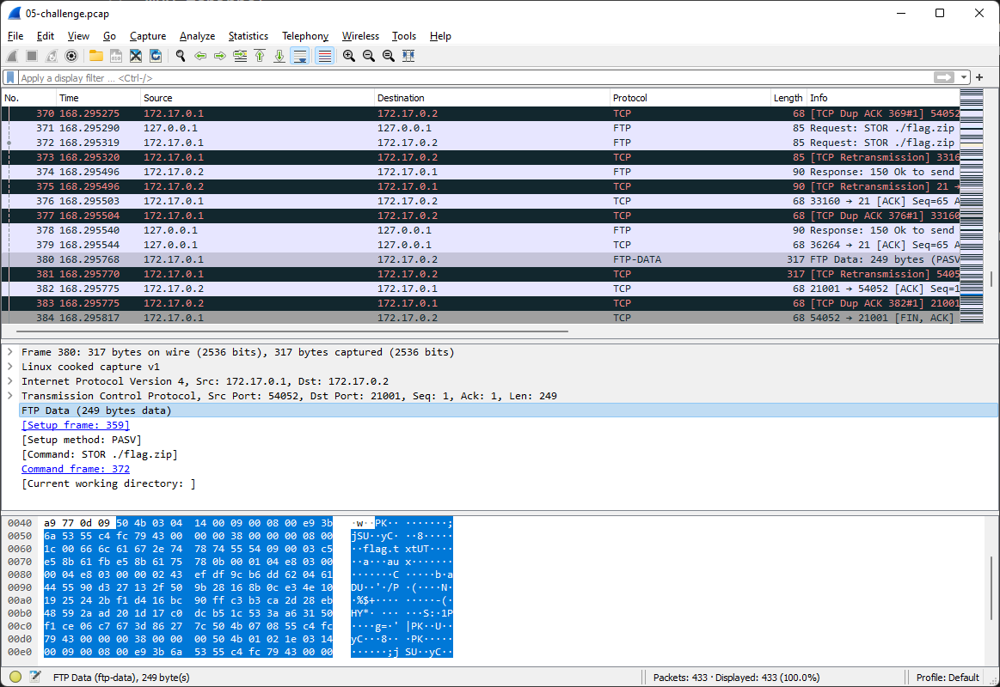

# 0x05 - Plain discussion

> A spy was listening in on some of our discussion about todays challenge. Can you figure out what he found?
> 
> https://rsxc.no/a28ac32e489c7714b63e26df0f8f0c71d0460e97b898299d32b30192f8f017af/05-challenge.pcap

---

When looking at `05-challenge.pcap` we can see some IRC protocol packets. The contents are not encrypted, so we can easily follow the TCP stream and read the chat messages.



IRC log from `05-challenge.pcap`:
```
...
PRIVMSG chris :Hey!
PRIVMSG #channel :Hey, got any suggestions for the challenge? Any way we can make it harder to get the flag?
:chris!ubuntu@172.17.0.1 PRIVMSG #channel :What about encrypting a zip file containing the flag? Let's say a 10 digit long number above 9 954 000 000 as the password?
PRIVMSG #channel :Sound like a great idea! I will get right too it!
QUIT :leaving
...
```

The chat talks about a ZIP-file and also contains a password hint. I'm sure we can extract the ZIP file from the `.pcap` file and crack the password using `john`.

Let's start by finding and extracting the ZIP file. The ZIP file was uploaded to an FTP-server and we can easily export the file; `flag.zip` from the packet capture.



Let's prepare the hash needed for `john`:
```
$ zip2john 0x05-flag.zip > 0x05-flag.zip.john
ver 2.0 efh 5455 efh 7875 0x05-flag.zip/flag.txt PKZIP Encr: 2b chk, TS_chk, cmplen=67, decmplen=56, crc=79FCC455
```

`0x05-flag.zip`
```
0x05-flag.zip/flag.txt:$pkzip2$1*2*2*0*43*38*79fcc455*0*42*8*43*79fc*3be9*0243efdf9cb6dd620461445590d327132f509b28168b0ce34e101925242bf1d416bc90ffc3b3ca2d28eb48592aad201d17c0dcb51c533aa63150f1ce06c7673d86277c*$/pkzip2$:flag.txt:0x05-flag.zip::0x05-flag.zip
```

Ok, now we have everything we need to crack the ZIP-file.

By using the password hint from the chat log we can specify the following rules for `john`.

- --mask=9954?d?d?d?d?d?d
- -min-len=10 

This should make cracking the password a breeze.

```bash
$ john --mask=9954?d?d?d?d?d?d -min-len=10 0x05-flag.zip.john
Using default input encoding: UTF-8
Loaded 1 password hash (PKZIP [32/64])
Will run 12 OpenMP threads
Press 'q' or Ctrl-C to abort, almost any other key for status
0g 0:00:00:00  (10) 0g/s 0p/s 0c/s 0C/s
9954359864       (0x05-flag.zip/flag.txt)
1g 0:00:00:00 DONE (10) (2021-12-06 17:42) 16.66g/s 13107Kp/s 13107Kc/s 13107KC/s 9954586054..9954039564
Use the "--show" option to display all of the cracked passwords reliably
Session completed
```

`john` finds the password in no time! The password is; `9954359864`.

## Solution

```
$ unzip 0x05-flag.zip
Archive:  0x05-flag.zip
[0x05-flag.zip] flag.txt password:
  inflating: flag.txt

$ cat flag.txt
RSXC{Good_job_analyzing_the_pcap_did_you_see_the_hint?}
```

The flag is: `RSXC{Good_job_analyzing_the_pcap_did_you_see_the_hint?}`
