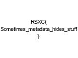

# 0x07 - This is quite meta

> We found this picture that seemed to contain the flag, but it seems like it has been cropped, are you able to help us retrieve the flag?
> 
> https://rsxc.no/6c9161113dadfbb06d6865f9db5499bd701067c9d69c2452894a8fcf697d21d9/07-challenge.jpg

---

`07-challenge.jpg`


This file seems to hide a flag. Let's use some standard tools to see what we find.

```bash
$ file 07-challenge.jpg
07-challenge.jpg: JPEG image data, JFIF standard 1.01, resolution (DPI), density 96x96, segment length 16, comment: "CREATOR: gd-jpeg v1.0 (using IJG JPEG v80), quality = 75", Exif Standard: [TIFF image data, big-endian, direntries=4, xresolution=62, yresolution=70, resolutionunit=2], baseline, precision 8, 798x69, components 1
```

```bash
$ exiv2 07-challenge.jpg
# nothing interesting
```

```bash
$ exiftool 07-challenge.jpg
# nothing interesting
```

```bash
$ binwalk 07-challenge.jpg

DECIMAL       HEXADECIMAL     DESCRIPTION
--------------------------------------------------------------------------------
0             0x0             JPEG image data, JFIF standard 1.01
91            0x5B            TIFF image data, big-endian, offset of first image directory: 8
199           0xC7            JPEG image data, JFIF standard 1.01
```

`binwalk` seems to find something more interesting. We can see 2 entries for `JPEG image data`.

Let's extract all entries and give them a `.jpg` extension:

```bash
$ binwalk --dd='.*':jpg 07-challenge.jpg

DECIMAL       HEXADECIMAL     DESCRIPTION
--------------------------------------------------------------------------------
0             0x0             JPEG image data, JFIF standard 1.01
91            0x5B            TIFF image data, big-endian, offset of first image directory: 8
199           0xC7            JPEG image data, JFIF standard 1.01
```

The extracted files are located in; `_07-challenge.jpg.extracted`. Let's have a look.

```bash
$ ll _07-challenge.jpg.extracted/
total 36
-rw-r--r-- 1 hag hag 9212 Dec  7 11:50 0.jpg
-rw-r--r-- 1 hag hag 9121 Dec  7 11:50 5B.jpg
-rw-r--r-- 1 hag hag 9013 Dec  7 11:50 C7.jpg
```

And here are the images:

### 0.jpg


### 5B.jpg
Invalid image data.

### C7.jpg



## Solution

The flag is: `RSXC{Sometimes_metadata_hides_stuff}`
