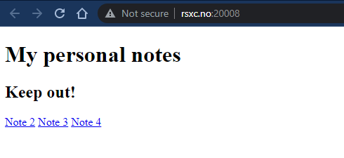
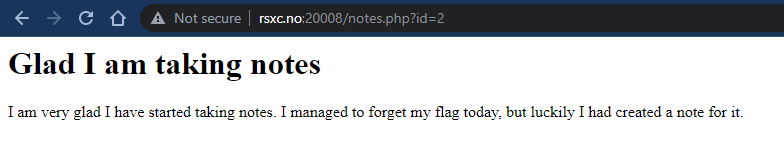
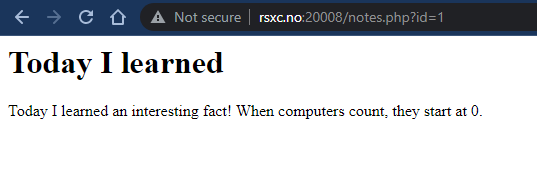
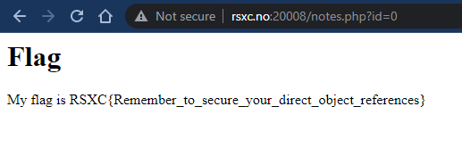

# 0x08 - The reference

> I just created a new note saving application, there is still some improvements that can be made but I still decided to show it to you!
> 
> http://rsxc.no:20008

---

## Application @ http://rsxc.no:20008

Looks like we are working with some kind of note taking application. We see a list of 3 notes; "Note 2", "Note 3" and "Note 4". Let's navigate to a note:

We can see that the `id` in the URI is `2` for this note. Let's try and change the `id` to `1` and see what happens. There was no link to "Note 1".

I'm not going to lie, I was expecting to find the flag here, instead I get taunted 😆. Zero indexing is not really that common for database indexes to be fair. Anyway, enough excuses. Let's just try `id=0`.

...and there's our flag!

## Solution

The flag is: `RSXC{Remember_to_secure_your_direct_object_references}`
