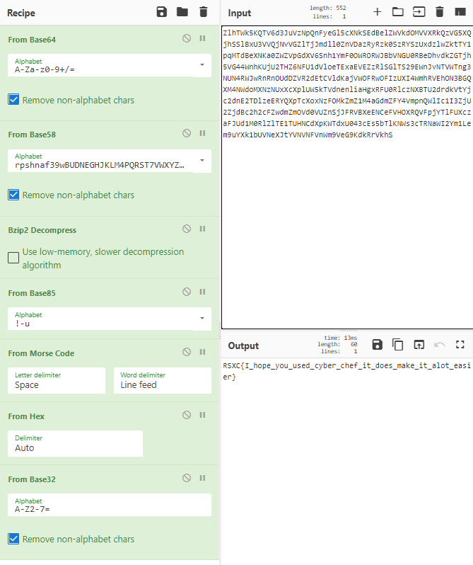

# 0x03 - What does this mean?

> When looking for the prizes to this challenge we came across some text we can't understand, can you help us figure out what it means?
> 
> https://rsxc.no/274d11760e75cfd2c5f6a8a1198a6c19ddee702a8b7e26102e8e48f0212cc278/03-challenge.txt

---

`03-challenge.txt`
```
ZlhTWk5KQTV6d3JuVzNpQnFyeGl5cXNkSEdBelZWVkdOMVVXRkQzVG5XQjhSSlBxU3VVQjNvVGZlTjJmdll0ZnVDazRyRzk0SzRYSzUxdzlwZktTY1pqMTdBeXNKa0ZWZVpGdXV6Snh1YmF0OWRORWJBbVNGU0RBeDhvdkZGTjh5VG44WnhKUjU2THZ6NFU1dVloeTExaEVEZzRlSGlTS29EWnJvNTVWTng3NUN4RWJwRnRnOUdDZVR2dEtCVldKajVWOFRwOFIzUXI4WmhRVEhON3BGQXM4NWdoMXNzNUxXcXplUW5kTVdnenliaHgxRFU0RlczNXBTU2drdkVtYjc2dnE2TDlzeERYQXpTcXoxNzFOMkZmZ1M4aGdmZFY4VmpnQWlIc1I3ZjU2ZjdBc2h2cFZwdmZmOVd0VUZnSjJFRVBXeENCeFVHOXRQVFpjYTlFUXczaFJUd1M0RlZlTE1TUHNCdXpKWTdxU043cEs5bTlKNWs3cTRNaWI2Ym1Lem9uYXk1bUVNeXJtYVNVNFVnWm9VeG9KdkRrVkhS
```

* I started by opening CyberChef and added the `base64`-decoder. The result looked like some more `baseX`-encoded data...

* Next step was `base58`, but with the `Ripple`-alphabet; `rpshnaf39wBUDNEGHJKLM4PQRST7VWXYZ2bcdeCg65jkm8oFqi1tuvAxyz`.

* We can now see the `BZ` characters in the start of the result; `BZh91AY&SYÍ`. This indicates `BZip` compression. So let's add the decompressor.

* This step was the most annoying one. After some trial and error and some Google searches I found the next step, which is `base85`. The repeating patterns was confusing, but is caused by the `Morse Code` in the result.

* This is clearly morse code, so I added `From Morse Code` to the recipe.

* Next we have hexadecimal values, so I added `From Hex`.

* This looks like some `baseX`-encoding again. Tried the different ones and `Base32` gives the flag.

Full `CyberChef`-recipe:

`https://gchq.github.io/CyberChef/#recipe=From_Base64('A-Za-z0-9%2B/%3D',true)From_Base58('rpshnaf39wBUDNEGHJKLM4PQRST7VWXYZ2bcdeCg65jkm8oFqi1tuvAxyz',true)Bzip2_Decompress(false)From_Base85('!-u')From_Morse_Code('Space','Line%20feed')From_Hex('Auto')From_Base32('A-Z2-7%3D',true)&input=WmxoVFdrNUtRVFY2ZDNKdVZ6TnBRbkZ5ZUdsNWNYTmtTRWRCZWxaV1ZrZE9NVlZYUmtRelZHNVhRamhTU2xCeFUzVlZRak52VkdabFRqSm1kbGwwWm5WRGF6UnlSemswU3pSWVN6VXhkemx3Wmt0VFkxcHFNVGRCZVhOS2EwWldaVnBHZFhWNlNuaDFZbUYwT1dST1JXSkJiVk5HVTBSQmVEaHZka1pHVGpoNVZHNDRXbmhLVWpVMlRIWjZORlUxZFZsb2VURXhhRVZFWnpSbFNHbFRTMjlFV25Kdk5UVldUbmczTlVONFJXSndSblJuT1VkRFpWUjJkRXRDVmxkS2FqVldPRlJ3T0ZJelVYSTRXbWhSVkVoT04zQkdRWE00Tldkb01YTnpOVXhYY1hwbFVXNWtUVmRuZW5saWFIZ3hSRlUwUmxjek5YQlRVMmRyZGtWdFlqYzJkbkUyVERsemVFUllRWHBUY1hveE56Rk9Na1ptWjFNNGFHZG1aRlk0Vm1wblFXbEljMUkzWmpVMlpqZEJjMmgyY0Zad2RtWm1PVmQwVlVablNqSkZSVkJYZUVOQ2VGVkhPWFJRVkZwallUbEZVWGN6YUZKVWQxTTBSbFpsVEUxVFVITkNkWHBLV1RkeFUwNDNjRXM1YlRsS05XczNjVFJOYVdJMlltMUxlbTl1WVhrMWJVVk5lWEp0WVZOVk5GVm5XbTlWZUc5S2RrUnJWa2hT`



## Solution

The flag is: `RSXC{I_hope_you_used_cyber_chef_it_does_make_it_alot_easier}`