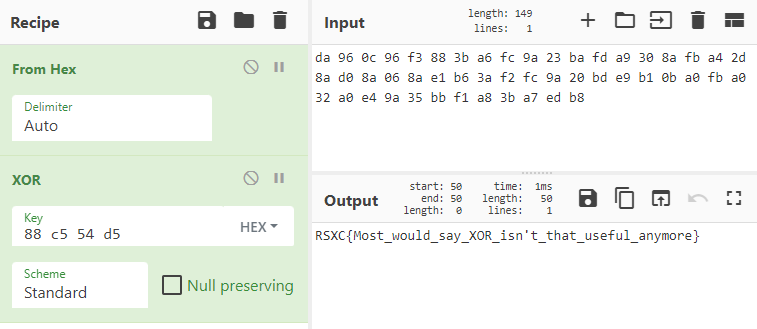

# 0x04 - 4 Bytes of XOR

> The flag of the day can be found by xor'ing our text with 4 bytes.
> 
> https://rsxc.no/e26113731cc5514c745bd8f4bdfd43a25b3a9e2286f48fba887910f16e5ad049/04-challenge.txt

---

`04-challenge.txt`
```
0xda0x960x0c0x960xf30x880x3b0xa60xfc0x9a0x230xba0xfd0xa90x300x8a0xfb0xa40x2d0x8a0xd00x8a0x060x8a0xe10xb60x3a0xf20xfc0x9a0x200xbd0xe90xb10x0b0xa00xfb0xa00x320xa00xe40x9a0x350xbb0xf10xa80x3b0xa70xed0xb8
```

This one should be easy. This cipher text is the result of the plain text being XOR'ed by the 4 byte key. We know that the plain text most likely starts with `RSXC` which is the start of the flag we're looking for.

This means that by XOR-ing the first 4 bytes of the cipher text with `RSXC` we get the key.

First we format the cipher text a bit:

```
da 96 0c 96 f3 88 3b a6 fc 9a 23 ba fd a9 30 8a fb a4 2d 8a d0 8a 06 8a e1 b6 3a f2 fc 9a 20 bd e9 b1 0b a0 fb a0 32 a0 e4 9a 35 bb f1 a8 3b a7 ed b8
```

The first 4 bytes are; `da 96 0c 96`. `RSXC` in hex is; `52 53 58 43`.

`(da 96 0c 96) ^ (52 53 58 43)` gives us; `88 c5 54 d5`.

That means that the 4 byte key is; `88 c5 54 d5`. Let's apply that to the cipher text in CyberChef:



## Solution

The flag is: `RSXC{Most_would_say_XOR_isn't_that_useful_anymore}`