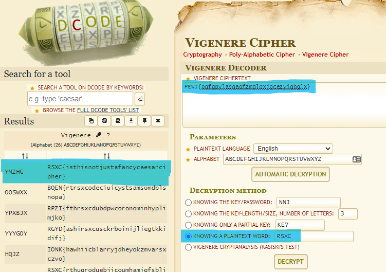

# 0x06 - The indecipherable cipher

> We recently did some research on some old ciphers, and found one that supposedly was indecipherable, but maybe you can prove them wrong?
> 
> https://rsxc.no/af00ef8611422bdcd1606f51a55ccbccf16c6ac56a1bea01e4e725dae506aaf0/06-challenge.txt

---

`06-challenge.txt`
```
PEWJ{oqfgpylasqaqfzmgloxjgcezyigbglx}
```

Looks like the result of a substitution cipher. Maybe `Vigenere`?

Let's try: https://www.dcode.fr/vigenere-cipher

We enter the cipher text and the known part of the plain text; which is `RSXC`. Let's click `DECRYPT`.

The online tool easily cracked the cipher for us:


## Solution

The flag is: `RSXC{isthisnotjustafancycaesarcipher}`
