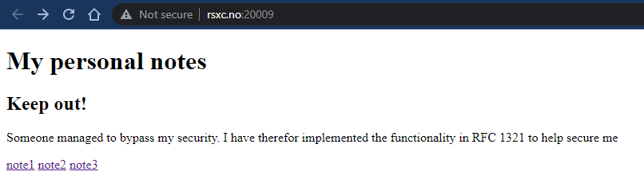
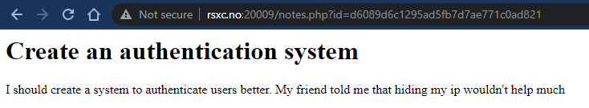
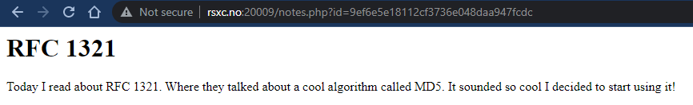
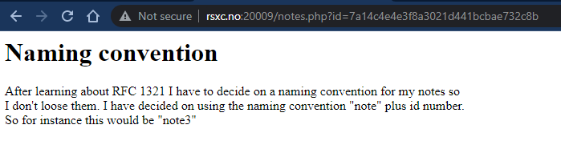
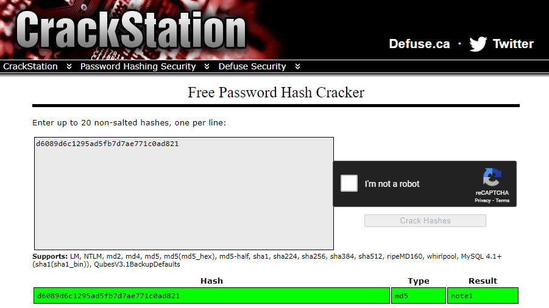
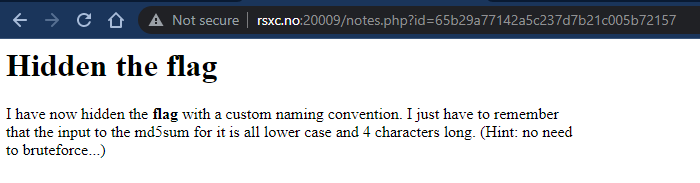
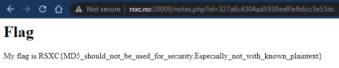

# 0x09 - The reference 2

> I see that someone managed to read my personal notes yesterday, so I have improved the security! Good luck!
> 
> http://rsxc.no:20009

---

Let's have a look at the upgraded note taking application.



note1



note2



note3



We can see that the `id` parameter is no longer an incrementing integer. It has been changed to some kind of hash. In the different notes we can see references to `RFC 1321` and `md5`.

It sounds like the hash is created based on a naming convention; `{note}{id}`. Let's just paste the hash for `note1` into CrackStation and see if we get a hit.



And it looks like we're correct. The hash matches `md5("note1")`.

Let's use what we know and try and have a look at `note0`.

```bash
$ echo -n "note0" | md5sum
65b29a77142a5c237d7b21c005b72157  -
```



The flag is a bit more hidden this time, but the hint is pretty strong here. Let's try `md5("flag")` as the `id`.

```bash
$ echo -n "flag" | md5sum
327a6c4304ad5938eaf0efb6cc3e53dc  -
```

Success!




## Solution

```
My flag is RSXC{MD5_should_not_be_used_for_security.Especially_not_with_known_plaintext}
```
