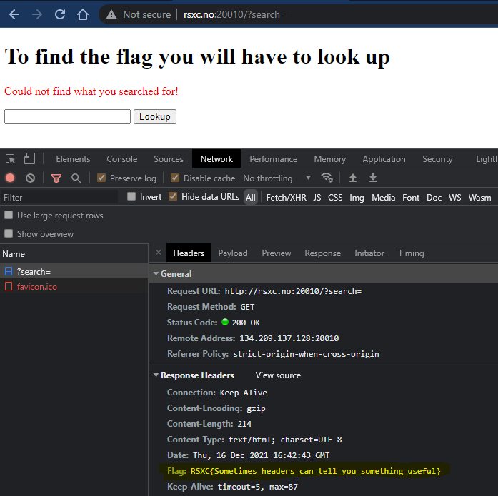

# 0x0a - Lookup

> Sometimes you need to look up to get the answer you need.
> 
> http://rsxc.no:20010

---

## Developer Tools

This website presents us with a form. I started doing some test requests. Blank. Some command injection payloads. Then I opened dev tools to have a look at the form request.

It didn't take long to spot the `header`; `Flag: RSXC{Sometimes_headers_can_tell_you_something_useful}`.




---

## Curl

The hint to "look up" refers to the `HTTP`-response I guess. Let's have a look using `curl` as well:

```bash
$ curl -v http://rsxc.no:20010/?search=
*   Trying 134.209.137.128:20010...
* Connected to rsxc.no (134.209.137.128) port 20010 (#0)
> GET /?search= HTTP/1.1
> Host: rsxc.no:20010
> User-Agent: curl/7.74.0
> Accept: */*
>
* Mark bundle as not supporting multiuse
< HTTP/1.1 200 OK
< Date: Thu, 16 Dec 2021 16:47:16 GMT
< Server: Apache/2.4.51 (Debian)
< X-Powered-By: PHP/7.4.26
< Flag: RSXC{Sometimes_headers_can_tell_you_something_useful}
< Vary: Accept-Encoding
< Content-Length: 285
< Content-Type: text/html; charset=UTF-8
<
<!DOCTYPE html>
<html>
<head>
</head>
<body>
  <h1>To find the flag you will have to look up</h1>
  <p style='color:red;'>Could not find what you searched for!</p>  <form action=".">
    <input name="search"></input>
    <button type="submit">Lookup</button>
  </form>
</body>
</html>
```

As we can see, we have to "look up" in the `HTTP`-response to see the full request and `headers`.

## Solution

The flag is: `RSXC{Sometimes_headers_can_tell_you_something_useful}`
