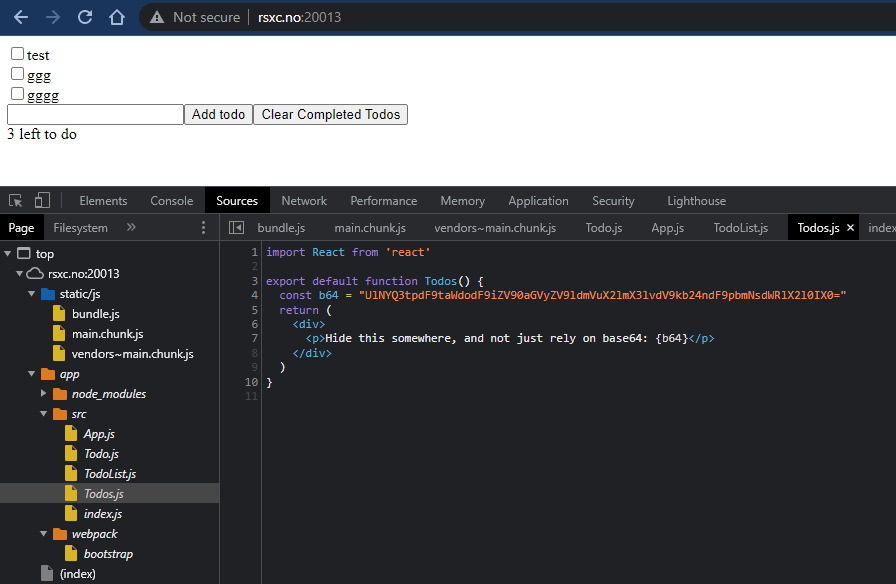

# 13 - New technology is hard
 
> When starting with new languages and frameworks, it is easy to get confused, and do things you shouldn't.
> 
> http://rsxc.no:20013

---

Looking around the web site and developer tools I found some suspicious base64 encoded data:



Let's decode the data:

```bash
$ echo "UlNYQ3tpdF9taWdodF9iZV90aGVyZV9ldmVuX2lmX3lvdV9kb24ndF9pbmNsdWRlX2l0IX0=" | base64 -d

RSXC{it_might_be_there_even_if_you_don't_include_it!}
```


## Solution

The flag is: `RSXC{it_might_be_there_even_if_you_don't_include_it!}`
