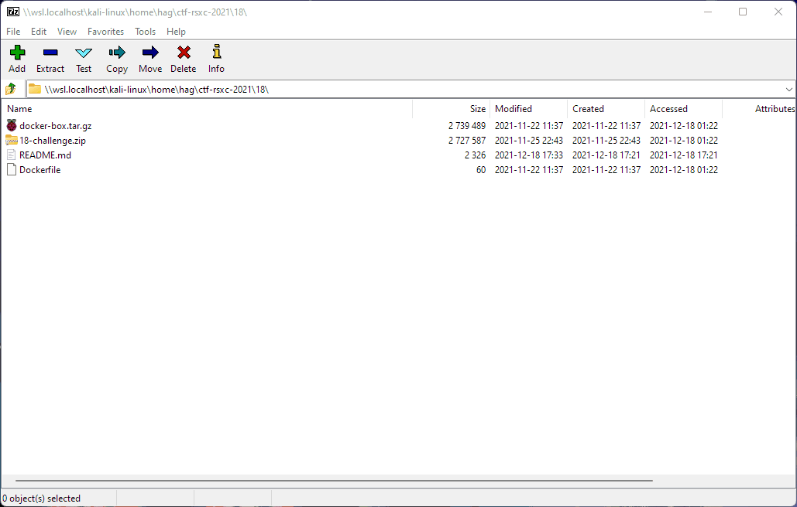
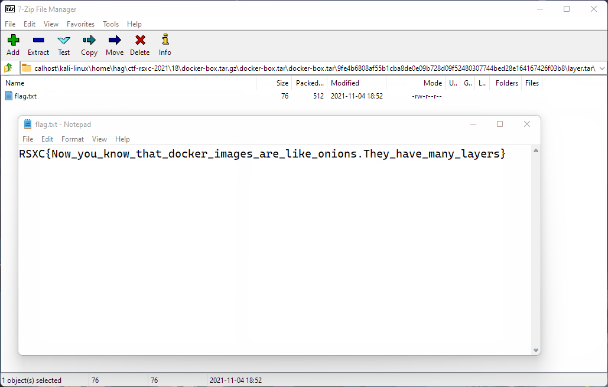

# 18 - Remember the flag? Docker remembers

> We found a docker image, but it seems that the flag has been removed from it, could you help us get it back?
> 
> https://rsxc.no/798d1de7d544fe090786f5930d137b863ff46dd19a018882ed2812a835517d1b/18-challenge.zip

---

Let's `unzip 18-challenge.zip`:

```bash
$ unzip 18-challenge.zip
Archive:  18-challenge.zip
  inflating: Dockerfile
  inflating: docker-box.tar.gz
```

We have a `Dockerfile`:

```dockerfile
$ cat Dockerfile
FROM alpine:3.14
COPY ./flag.txt /flag.txt
RUN rm /flag.txt
```

The `Dockerfile` indicates that a flag gets copied to the docker image. I'm asuming that `docker-box.tar.gz` is an export of a docker instance running this image.

My next plan was to do this in a proper way and try to figure out how to use `docker` to have a look at the exported instance.

I figured out how to import the export and look at the history:

```bash
$ tar xfv docker-box.tar
docker-box.tar

$ docker load < docker-box.tar
e2eb06d8af82: Loading layer [==================================================>]  5.865MB/5.865MB
7749911baef1: Loading layer [==================================================>]  2.048kB/2.048kB
862657ef5df5: Loading layer [==================================================>]  1.536kB/1.536kB
Loaded image: docker-box:latest

$ docker images
REPOSITORY                                   TAG       IMAGE ID       CREATED        SIZE
docker-box                                   latest    277cb1d569ea   6 weeks ago    5.6MB

$ docker history docker-box
IMAGE          CREATED        CREATED BY                                      SIZE      COMMENT
277cb1d569ea   6 weeks ago    /bin/sh -c rm /flag.txt                         0B
<missing>      6 weeks ago    /bin/sh -c #(nop) COPY file:49e1c3ab94949280…   76B
<missing>      3 months ago   /bin/sh -c #(nop)  CMD ["/bin/sh"]              0B
<missing>      3 months ago   /bin/sh -c #(nop) ADD file:aad4290d27580cc1a…   5.6MB
```

As we can see it looks like the `flag.txt` was deleted at some point. Now I spent some time to figure out how to roll back to a point before the deletion. However I ended up just using `7-Zip` to easily explore the export and all the file system layers.

Here's a `gif`:



## Solution

The flag is: `RSXC{Now_you_know_that_docker_images_are_like_onions.They_have_many_layers}`

