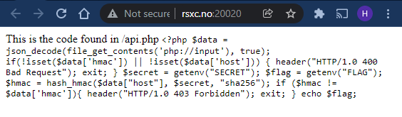
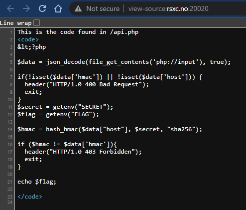

# 20 - Easy mistakes

> When programming, it is easy to make simple mistakes, and some of them can have dire consequences.
> 
> http://rsxc.no:20020

---

When looking at the website we can see some `PHP` code. Apparently this code belongs to `/api.php`.



Let's do "view source" to see the code part formatted.



That's better. So the script reads in the raw request body and tries to decode it as `json`. Then it looks for the `hmac` and `host` properties. If they're missing the script returns `400 Bad Request`. Let's verify:

```bash
$ curl -v http://rsxc.no:20020/api.php
*   Trying 134.209.137.128:20020...
* Connected to rsxc.no (134.209.137.128) port 20020 (#0)
> GET /api.php HTTP/1.1
> Host: rsxc.no:20020
> User-Agent: curl/7.74.0
> Accept: */*
>
* Mark bundle as not supporting multiuse
* HTTP 1.0, assume close after body
< HTTP/1.0 400 Bad Request
< Date: Fri, 24 Dec 2021 11:45:17 GMT
< Server: Apache/2.4.51 (Debian)
< X-Powered-By: PHP/7.4.26
< Content-Length: 0
< Connection: close
< Content-Type: text/html; charset=UTF-8
<
* Closing connection 0
```

Seems to be correct. Now let's give the script a `json`-payload with the `hmac` and `host` properties:

```bash
$ curl -v http://rsxc.no:20020/api.php -d '{ "hmac": "", "host": "" }'
*   Trying 134.209.137.128:20020...
* Connected to rsxc.no (134.209.137.128) port 20020 (#0)
> POST /api.php HTTP/1.1
> Host: rsxc.no:20020
> User-Agent: curl/7.74.0
> Accept: */*
> Content-Length: 26
> Content-Type: application/x-www-form-urlencoded
>
* upload completely sent off: 26 out of 26 bytes
* Mark bundle as not supporting multiuse
< HTTP/1.1 200 OK
< Date: Mon, 20 Dec 2021 14:51:13 GMT
< Server: Apache/2.4.51 (Debian)
< X-Powered-By: PHP/7.4.26
< Content-Length: 53
< Content-Type: text/html; charset=UTF-8
<
* Connection #0 to host rsxc.no left intact
RSXC{You_have_to_have_the_right_order_for_arguments!}
```

I'll be honest, I didn't expect to see the flag already! I was expecting to receive a `403 Forbidden` and having to look closer into the implementation to figure out how to bypass the `if ($hmac != $data['hmac'])` check.

Let's look a bit closer at this anyway to try and figure out what happened. The flag itself contains a clue. Looks like we might have some issue with the order of the arguments given to the `hash_hmac` call.

This is the expected arguments, taken from the docs here: https://www.php.net/manual/en/function.hash-hmac.php.

```php
hash_hmac(
    string $algo,
    string $data,
    string $key,
    bool $binary = false
): string
```

When we compare the arguments order in the docs with the ones in our code we can clearly see that they're mixed up.

```php
$hmac = hash_hmac($data["host"], $secret, "sha256");
```

Now I created a test script:

```php
<?php
$data = json_decode('{ "hmac": "", "host": "" }');
$hmac = hash_hmac($data["host"], $secret, "sha256");
var_dump($data);
var_dump($hmac);
```

```
$ php test.php

PHP Fatal error:  Uncaught Error: Cannot use object of type stdClass as array in test.php:3
```

However I get an error on line 3. This error completely halts the script execution and shouldn't let us bypass the `if ($hmac != $data['hmac'])` check. I guess there is some PHP version and/or configuration differences or the `api.php` is actually different on the server.

That's all I have time for today, but at least we got the flag!


## Solution

The flag is: `RSXC{You_have_to_have_the_right_order_for_arguments!}`
