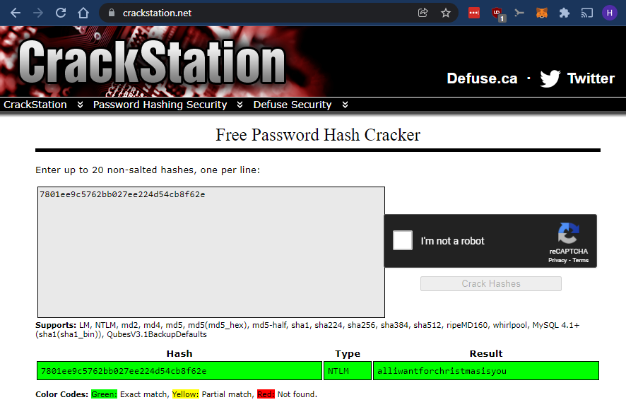

# 21 - Nice memories

> **Note: The flag is the clear text password for river-security-xmas user.**
>
> On a IR mission we found that the threatactor dumped lsass file.
> Can you rock our world and find the flag for us?
>
> https://rsxc.no/35a2c6961adc6886665363b6f47c3a156356a91a4cf602416b250aa4daca4167/21-challenge.zip

---

This one looks interesting! Let's get the files.

```bash
$ unzip 21-challenge.zip
Archive:  21-challenge.zip
  inflating: lsass.DMP

$ file lsass.DMP
lsass.DMP: Mini DuMP crash report, 16 streams, Fri Nov 12 12:33:06 2021, 0x421826 type
```

So we are working with a memory dump of the `lsass.exe` process from a running machine. This process keeps authentication information like hashes and sometimes clear text passwords in its memory.

We can use `mimikatz` or `pypykatz` to extract this information from a memory dump.

Let's use `pypykatz` for this one:

```bash
$ pypykatz lsa minidump lsass.DMP
INFO:root:Parsing file lsass.DMP
FILE: ======== lsass.DMP =======
== LogonSession ==
authentication_id 1304254 (13e6be)
session_id 2
username river-security-xmas
domainname DESKTOP-V1MQH3P
logon_server WIN-QC6FTBKEEE9
logon_time 2021-11-12T12:29:30.144510+00:00
sid S-1-5-21-2640804858-4017698289-1413954960-1001
luid 1304254
        == MSV ==
                Username: river-security-xmas
                Domain: DESKTOP-V1MQH3P
                LM: NA
                NT: 7801ee9c5762bb027ee224d54cb8f62e
                SHA1: bebad302f8e64b59279c3a6747db0e076800d9ca
        == WDIGEST [13e6be]==
                username river-security-xmas
                domainname DESKTOP-V1MQH3P
                password None
        == Kerberos ==
                Username: river-security-xmas
                Domain: DESKTOP-V1MQH3P
                Password: None
        == WDIGEST [13e6be]==
                username river-security-xmas
                domainname DESKTOP-V1MQH3P
                password None
        == DPAPI [13e6be]==
                luid 1304254
                key_guid 8199c4f5-2e70-4085-b054-f5dc35a9e0db
                masterkey f9ec0b90cae9953e1d1104deec16c393396c9d20774e8cc340c52dadf234f3b44b8fccf8dd385ea6019ef0475831564677f5f58926caf8835fbba33f192d3177
                sha1_masterkey 47599fa3a6f19b3b842f41889da96d69138ff3d2

# ... abbreviated
```

As we can see from the abbreviated output from `pypykatz` above, we managed to dump an `NT`-hash for the user `river-security-xmas`. The `NT`-hash is; `7801ee9c5762bb027ee224d54cb8f62e`.

The challenge text contains; `Can you rock our world and find the flag for us?`, which I guess is a hint and that the hash can be cracked using the `rockyou` wordlist.

However, the first thing I usually do with hashes like this is to just put them into https://crackstation.net/.



And we have a match. The password is `alliwantforchristmasisyou`.

Now let's do it again using `john` and `rockyou`:

```bash
$ echo "7801ee9c5762bb027ee224d54cb8f62e" > forjohn

$ cat forjohn
7801ee9c5762bb027ee224d54cb8f62e

$ john --format=NT --wordlist=/usr/share/wordlists/rockyou.txt forjohn
Using default input encoding: UTF-8
Loaded 1 password hash (NT [MD4 256/256 AVX2 8x3])
Warning: no OpenMP support for this hash type, consider --fork=16
Press 'q' or Ctrl-C to abort, almost any other key for status

alliwantforchristmasisyou (?)

1g 0:00:00:00 DONE (2021-12-24 13:39) 2.127g/s 21729Kp/s 21729Kc/s 21729KC/s alliwantisy0oh..allisonpunk
Session completed
```

And there we go!

## Solution

The flag is: `alliwantforchristmasisyou`
