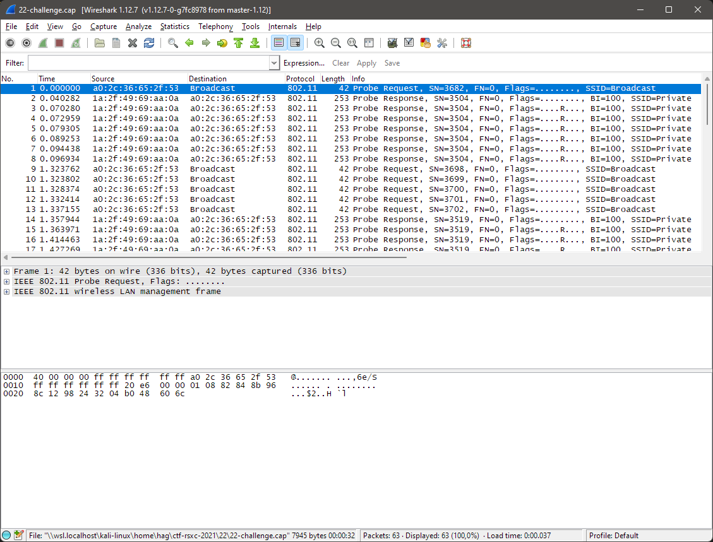
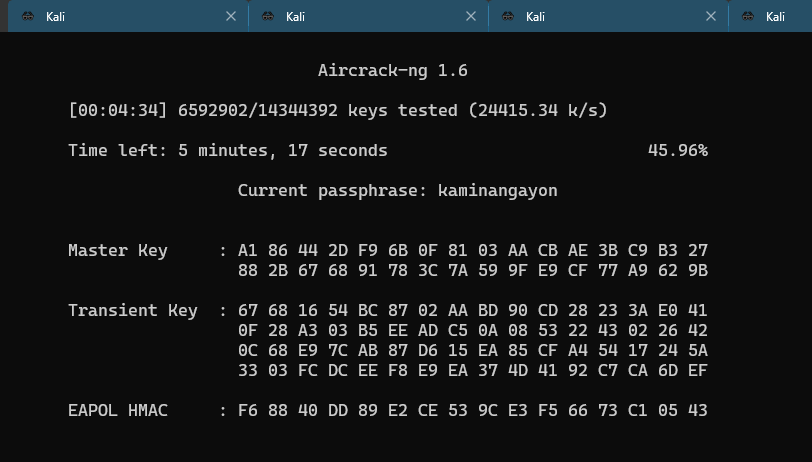
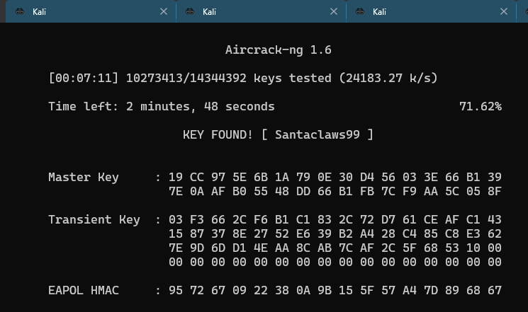
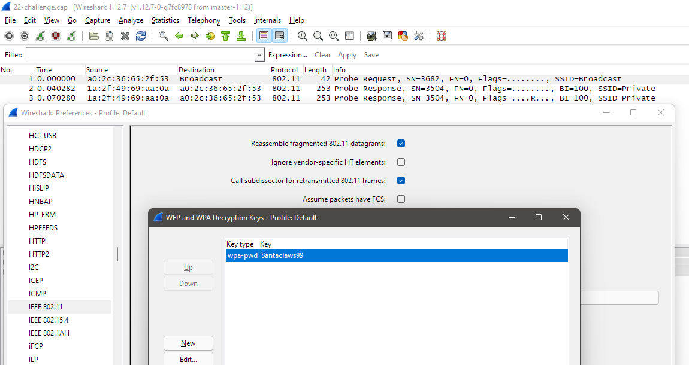
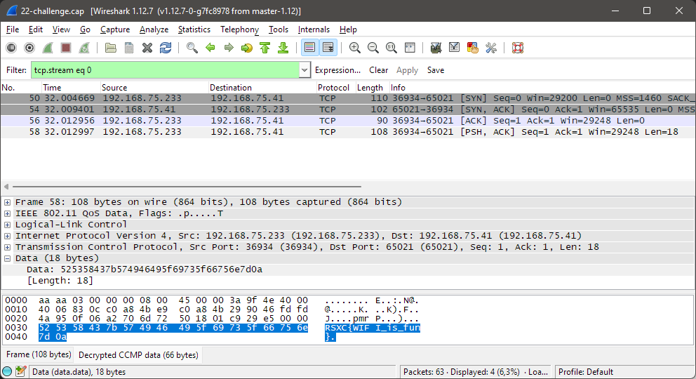
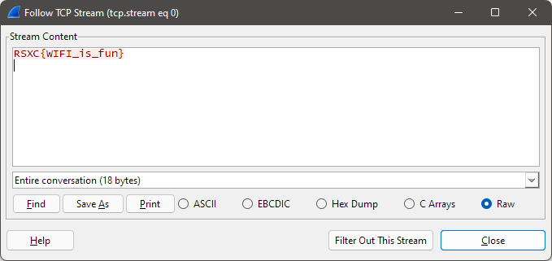

# 22 - Wireless communication

> We tried to find a new way of sending the flag, and this time it is even encrypted! Since we are nice we will even give you a hint. The password starts with S. Can you Rock our world?
> 
> https:///rsxc.no/5512383c4c02768617233eefdd4f79efe5dea9d08a850c8414644abf296845cf/22-challenge.cap

---

Another interesting one!

```bash
$ wget https://rsxc.no/5512383c4c02768617233eefdd4f79efe5dea9d08a850c8414644abf296845cf/22-challenge.cap
#...
2021-12-22 11:00:33 (503 MB/s) - ‘22-challenge.cap’ saved [7961/7961]

$ file 22-challenge.cap
22-challenge.cap: pcap capture file, microsecond ts (little-endian) - version 2.4 (802.11, capture length 262144)
```

So we have a `pcap` file this time. And based on the challenge text it sounds like it may contain some WiFi-packets. And they're encrypted. I haven't used `aircrack-ng` much, but I have a feeling we're going to use it shortly.

Let's take a look at the `pcap`-file using `tcpdump`:

```bash
$ tcpdump -r 22-challenge.cap
reading from file 22-challenge.cap, link-type IEEE802_11 (802.11), snapshot length 262144
13:24:54.693323 Probe Request () [1.0* 2.0* 5.5* 11.0* 6.0* 9.0 12.0* 18.0 Mbit]
13:24:54.733605 Probe Response (Private) [1.0* 2.0* 5.5* 11.0* 18.0 24.0 36.0 54.0 Mbit] CH: 11, PRIVACY
13:24:54.763603 Probe Response (Private) [1.0* 2.0* 5.5* 11.0* 18.0 24.0 36.0 54.0 Mbit] CH: 11, PRIVACY
13:24:54.766282 Probe Response (Private) [1.0* 2.0* 5.5* 11.0* 18.0 24.0 36.0 54.0 Mbit] CH: 11, PRIVACY
13:24:54.772628 Probe Response (Private) [1.0* 2.0* 5.5* 11.0* 18.0 24.0 36.0 54.0 Mbit] CH: 11, PRIVACY
13:24:54.782576 Probe Response (Private) [1.0* 2.0* 5.5* 11.0* 18.0 24.0 36.0 54.0 Mbit] CH: 11, PRIVACY
13:24:54.787761 Probe Response (Private) [1.0* 2.0* 5.5* 11.0* 18.0 24.0 36.0 54.0 Mbit] CH: 11, PRIVACY
13:24:54.790257 Probe Response (Private) [1.0* 2.0* 5.5* 11.0* 18.0 24.0 36.0 54.0 Mbit] CH: 11, PRIVACY
13:24:56.017085 Probe Request () [1.0* 2.0* 5.5* 11.0* 6.0* 9.0 12.0* 18.0 Mbit]
13:24:56.017125 Probe Request () [1.0* 2.0* 5.5* 11.0* 6.0* 9.0 12.0* 18.0 Mbit]
13:24:56.021697 Probe Request () [1.0* 2.0* 5.5* 11.0* 6.0* 9.0 12.0* 18.0 Mbit]
13:24:56.025737 Probe Request () [1.0* 2.0* 5.5* 11.0* 6.0* 9.0 12.0* 18.0 Mbit]
13:24:56.030478 Probe Request () [1.0* 2.0* 5.5* 11.0* 6.0* 9.0 12.0* 18.0 Mbit]

# ...abbreviated
```

The file seems to read fine and we are presented with the packets.

We can also open the file in `Wireshark` if we want to:



We can't get anything useful from these packets without decrypting them first, so let's do that next.

Time for `aircrack-ng`:

```bash
$ aircrack-ng 22-challenge.cap
Reading packets, please wait...
Opening 22-challenge.cap
Read 63 packets.

   #  BSSID              ESSID                     Encryption

   1  1A:2F:49:69:AA:0A  Private                   WPA (1 handshake)

Choosing first network as target.

Reading packets, please wait...
Opening 22-challenge.cap
Read 63 packets.

1 potential targets

Please specify a dictionary (option -w).
```

We see that `aircrack-ng` has identified a wireless network from the captured packets. Now we have to specify a wordlist to use for the password cracking:

```bash
$ aircrack-ng 22-challenge.cap -w /usr/share/wordlists/rockyou.txt
```



After a few minutes `aircrack-ng` presents the cracked password to us; `Santaclaws99`:



We already knew from the challenge text that the password started with `S` so we could have extracted all the passwords starting with `S`, but the cracking was fast anyway... :D

Now we need to decrypt the packets in the `pcap`-file. We can do this directly in `Wireshark` if we wanted to. Just open `Preferences` and go to `Protocols -> IEEE 802.11` and add the decryption key:



Now we can follow the relevant `TCP`-stream and find the flag:





But as usual, there are multiple ways of doing the same thing, so let's go back to the terminal.

We can use `airdecap-ng` to decrypt the `pcap`-file for us:

```bash
$ airdecap-ng 22-challenge.cap -p Santaclaws99 -e Private
Total number of stations seen            3
Total number of packets read            63
Total number of WEP data packets         0
Total number of WPA data packets        12
Number of plaintext data packets         0
Number of decrypted WEP  packets         0
Number of corrupted WEP  packets         0
Number of decrypted WPA  packets         6
Number of bad TKIP (WPA) packets         0
Number of bad CCMP (WPA) packets         0

$ ll
# ...abbreviated
-rw-r--r-- 1 hag hag   470 Dec 22 11:22 22-challenge-dec.cap
```

Now we can use the `22-challenge-dec.cap` file created for us. Now we can just try the quick and dirty `grep` way of doing things:

```bash
$ cat 22-challenge-dec.cap | grep -a "RSXC"
HH@�&�O�,6e/E:�N@@�
                     ��K���K�F��J��pmrP��RSXC{WIFI_is_fun}
```

That works... And then the "proper" way:

```bash
$ tcpdump -A -r 22-challenge-dec.cap
reading from file 22-challenge-dec.cap, link-type EN10MB (Ethernet), snapshot length 65535
13:25:26.565890 ARP, Request who-has 192.168.75.41 tell 192.168.75.233, length 28
.........,6e/S..K.........K)
13:25:26.694459 ARP, Reply 192.168.75.41 is-at 40:1c:83:26:d5:4f (oui Unknown), length 28
........@..&.O..K).,6e/S..K.
13:25:26.697992 IP 192.168.75.233.36934 > 192.168.75.41.65021: Flags [S], seq 1251282693, win 29200, options [mss 1460,sackOK,TS val 1019977 ecr 0,nop,wscale 6], length 0
E..<.L@.@.....K...K).F..J.........r.EV.........
...I........
13:25:26.702724 IP 192.168.75.41.65021 > 192.168.75.233.36934: Flags [S.], seq 2725277041, ack 1251282694, win 65535, options [mss 1460,nop,wscale 8,nop,nop,sackOK], length 0
E..4.K@.......K)..K....F.pmqJ.......^...............
13:25:26.706279 IP 192.168.75.233.36934 > 192.168.75.41.65021: Flags [.], ack 1, win 457, length 0
E..(.M@.@.....K...K).F..J....pmrP.......
13:25:26.706320 IP 192.168.75.233.36934 > 192.168.75.41.65021: Flags [P.], seq 1:19, ack 1, win 457, length 18
E..:.N@.@.....K...K).F..J....pmrP...)...RSXC{WIFI_is_fun}
```

Ok, that's enough!

## Solution

The flag is: `RSXC{WIFI_is_fun}`
