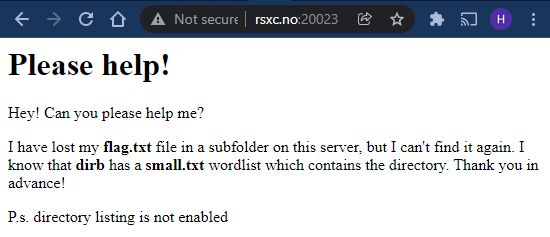
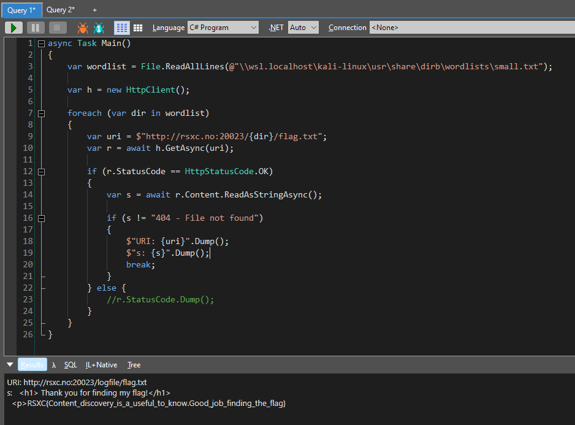

# 23 - Locating the location

> We seem to have lost a file, can you please help us find it?
> 
> http://rsxc.no:20023

---

Let's look at the web site:



Looks like we need to enumerate a subfolder on the web server and find the `flag.txt` file inside it. We also know that the name of the subfolder can be found in the `/usr/share/wordlists/dirb/small.txt` wordlist. I prefer to use `gobuster` for this kind of task. Let's fire it up:

```bash
$ gobuster dir -w /usr/share/wordlists/dirb/small.txt --url http://rsxc.no:20023/
===============================================================
Gobuster v3.1.0
by OJ Reeves (@TheColonial) & Christian Mehlmauer (@firefart)
===============================================================
[+] Url:                     http://rsxc.no:20023/
[+] Method:                  GET
[+] Threads:                 10
[+] Wordlist:                /usr/share/wordlists/dirb/small.txt
[+] Negative Status codes:   404
[+] User Agent:              gobuster/3.1.0
[+] Timeout:                 10s
===============================================================
2021/12/23 15:39:18 Starting gobuster in directory enumeration mode
===============================================================
Error: the server returns a status code that matches the provided options for non existing urls. http://rsxc.no:20023/90b6d4af-402d-48f9-ba16-05511c4d8c69 => 200 (Length: 20). To continue please exclude the status code, the length or use the --wildcard switch
```

Ok, so it seems that the server responds with `200 OK` even if the directory doesn't exist, but with a `body` of `404 - File not found`. We have to let `gobuster` know how to see the difference between them. We can see that the lengt of the `404 - File not found` response is `20 bytes`. So let's filter out any response with that length.

```bash
$ gobuster dir -w /usr/share/wordlists/dirb/small.txt --url http://rsxc.no:20023/ --exclude-length 20
===============================================================
Gobuster v3.1.0
by OJ Reeves (@TheColonial) & Christian Mehlmauer (@firefart)
===============================================================
[+] Url:                     http://rsxc.no:20023/
[+] Method:                  GET
[+] Threads:                 10
[+] Wordlist:                /usr/share/wordlists/dirb/small.txt
[+] Negative Status codes:   404
[+] Exclude Length:          20
[+] User Agent:              gobuster/3.1.0
[+] Timeout:                 10s
===============================================================
2021/12/23 15:45:03 Starting gobuster in directory enumeration mode
===============================================================
Progress: 1457 / 87665 (1.66%)^C
[!] Keyboard interrupt detected, terminating.

===============================================================
2021/12/23 15:45:08 Finished
===============================================================
```

Ok, looks like searching works now, but I'm not sure how the server would respond if the directory exists and we know that directory listing is disabled so we might not get a result at all.

Also, `gobuster` can search for files with specified extensions, but I can't find a way to give it an exact filename...

Let's just create our own script for this challenge! Let's use `C#` instead of `Python` for this one.


I usually use `LINQPad` to quickly create `C#` scripts:



The script just loads in the `/usr/share/wordlists/dirb/small.txt`-wordlist, iterates through all the lines and sends a request for each directory name until it finds the `flag.txt`-file. After adding a bit of logic to handle the special 404 responses, it worked perfectly!

We've solved the challenge, but I like to be able to do as much as possible in the terminal, so let's migrate the script into a .NET 5 console app that can run in the Kali terminal.

Let's create the following script: `solve-script/Program.cs`:

```csharp
using System;
using System.IO;
using System.Net;
using System.Net.Http;
using System.Threading.Tasks;

class Program
{
    static async Task Main()
    {
        var wordlist = File.ReadAllLines(@"/usr/share/wordlists/dirb/small.txt");

        var h = new HttpClient();

        foreach (var dir in wordlist)
        {
            var uri = $"http://rsxc.no:20023/{dir}/flag.txt";
            var r = await h.GetAsync(uri);

            if (r.StatusCode == HttpStatusCode.OK)
            {
                var s = await r.Content.ReadAsStringAsync();

                if (s != "404 - File not found")
                {
                    Console.WriteLine($"URI: {uri}");
                    Console.WriteLine($"s: {s}");
                    break;
                }
            }
            else
            {
                //r.StatusCode.Dump();
            }
        }
    }
}
```

Now let's run it using `dotnet run`:

```bash
$ cd solve-script/

$ dotnet run
URI: http://rsxc.no:20023/logfile/flag.txt
s:   <h1> Thank you for finding my flag!</h1>
  <p>RSXC{Content_discovery_is_a_useful_to_know.Good_job_finding_the_flag}

```


## Solution

The flag is: `RSXC{Content_discovery_is_a_useful_to_know.Good_job_finding_the_flag}`
